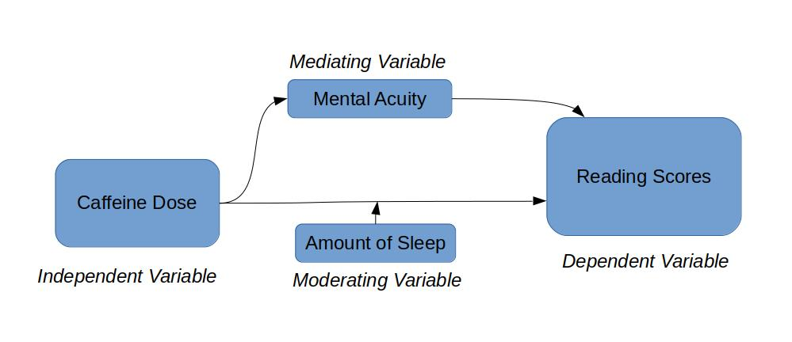
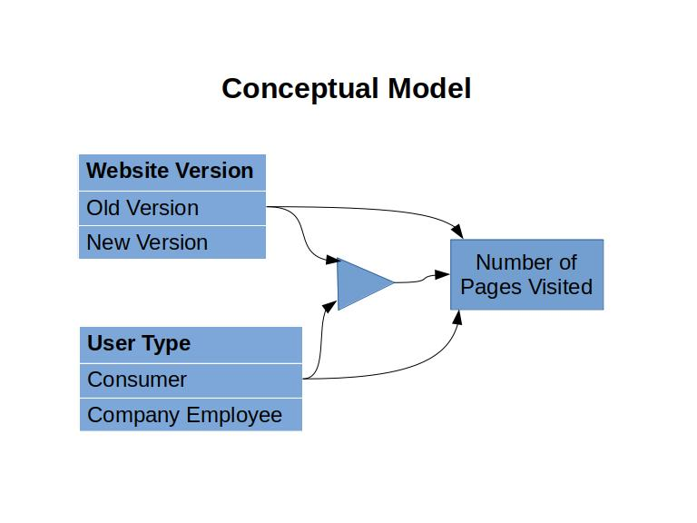
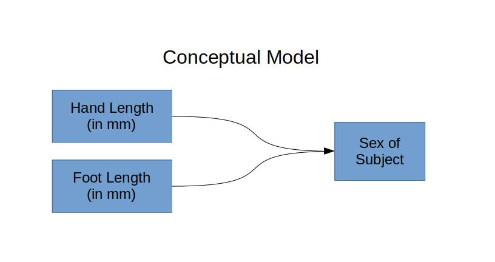

```{r setup, include=FALSE}
knitr::opts_chunk$set(echo = TRUE)
```


\tableofcontents

#Part 1 - Design and set-up of true experiment
## Motivation
  Students, researchers, and most people beyond these buckets believe that caffeine improves their productivity. Many even insist on having their morning coffee to do their work each day. We design an experiment to empirically evaluate the effects of caffeine as well as other intake trends on one's mental acuity.
  Perhaps caffeine truly improves one's performance in their studies or work. However, we may also investigate the existence of a placebo effect on one's work ethic. We also investigate more complex effects of caffeine with its relationship on mental acuity, such as the influence of the caffeine-induced "crash", and caffeine tolerance, and possible relationships between caffeine effectiveness and amount of sleep.

## Theory
  Academics have performed a host of analyses on the effects of caffeine on cognitive performance.  For example, a study by Nehlig at UDS found that caffeine changes memory performance in nuanced ways, and it likely does not change the aggregation of long-term memory [@Nehlig2010]. The study concluded that "caffeine cannot be considered a 'pure' cognitive enhancer", although it may indirectly influence, and possibly enhance, one's cognitive performance.[@Nehlig2010]. Another study by Pasman et al. found that, when taking cognition tests, scores of subjects did not improve, but the tests were completed "approximately 10% faster" [@Pasman2017]. The findings of these studies suggest that, while caffeine may not directly improve cognitive performance, indirect factors may still lead users to enjoy increased efficiency when doing their work.

## Research Question
  The question which we investigate with our true experiment is the following: Does caffeine intake improve a student's testing ability?

## Participants
  For convenience and consistency, the experiment will use students from TUDelft as participants. A sample from this population would likely generalize to broader student populations for the effects of caffeine intake. We can also find various levels of caffeine intake habits and regular sleep amounts. Lastly, because the students belong to the same university, we can expect that, with a lower variance in mental acuity, a smaller sample size could suffice for testing of statistical significance.
  One thing to consider is that, because TUDelft is a linguistically diverse university, we can make no assumptions about the language backgrounds of the students. As such, it is important to test subjects with means independent of reading ability, domain experience, etc.
  Administering of caffeine shall be transparent and consentual. Caffeine will be administered in commercially available forms and otherwise ordinary forms, with the possibility of caffeine-free doses.

\pagebreak

## Conceptual Model
**Dependent Variable:** IQ Test Score

We would like to see if caffeine intake improves one's test taking abilities. In particular, the subject will be given an IQ test, which can be used as an unbiased approximation of the mentual acuity of a subject. An IQ test would be the most fair form of judging a difference in test performance, independent of the background of the subject.

**Independent Variable:** Caffeine Administration (real or placebo)

**Mediating Variables:** Mental Acuity  

Mental acuity is perhaps the variable that we're more interested in, but there's no real way to measure this.

**Moderating Variable:** Amount of Sleep

<br/>

<br/>

\pagebreak

## Experimental Design
Our experiment is designed to watch test scores as related to caffeine ingestion. There will be two randomly assigned treatments, where subjects receive coffee with either 0mg of caffeine or 100mg of caffeine.


<br/>

<br/>

## Experimental Procedure
For the colection of data from test subjects:

1. Randomly sample a test subject from a place of study, and preemptively, randomly assign treatment to the subject
 * Treatment is either a 100mg dose of caffeine or a 0mg dose of caffeine, both served through a cup of coffee
 * We would need to find people who have not had any caffeine yet on the given day
2. Collect some preliminary information about the subject, including estimated sleep amount
3. administer a waiting period for the subject to go about other activities and allow the caffeine to kick in
 * Duration of waiting period will be influenced by academic literature about caffeine
4. After the waiting period, administer the IQ test
 * The test should be realistically impossible to complete in the given amount of time to avoid statistically meaningless score distributions

## Experiments and Suggested Statistical Analyses
To test the effects of caffeine intake on mental acuity, we would use a two-sample t-test.


#Part 2 - Generalized linear models
## Question 1: Twitter Sentiment Analysis (Between groups - single factor)
Set up libraries...
```{r}
if (F) {
  install.packages("base64enc", dependencies=T)
  install.packages("twitteR", dependencies=T)
  install.packages("plyr", dependencies=T)
  install.packages("stringr", dependencies=T)
  install.packages("container", dependencies=T)
}

library(container)
library(base64enc)
library(twitteR)
library(plyr)
library(stringr)
library(car)
```

\pagebreak

### Conceptual Model
Our tweet analysis seeks to answer the following question: Is there a difference in the sentiment of the tweets related to the different celebrities? This question is explored in the following conceptual model.

<br/>

<br/>

### Collecting Preliminary Data
Collect positive and negative words and related functions, set up Twitter oauth...
```{r}
# load local textfiles listing key positive and negative words
#taken from https://github.com/mjhea0/twitter-sentiment-analysis
positive_words = scan('./data/positive-words.txt', what = 'character', comment.char=';') #read the positive words
negative_words = scan('./data/negative-words.txt', what = 'character', comment.char=';') #read the negative words
source("sentiment3.R")

# set up twitter sesssion
source("twitter_keys.R") # imports consumer_key, consumer_secret, access_token, and access_secret
setup_twitter_oauth(consumer_key=consumer_key,
                    consumer_secret=consumer_secret,
                    access_token=access_token,
                    access_secret=access_secret)
```

Collect tweets about celebrities, calculate sentiment scores...
```{r}
tweetsFilename = 'data/tweets.csv'
n_tweets = 1e3
celebHandles = Dict$new(c("Kanye West" = "@KanyeWest",
                         "Drake" = "@Drake",
                         "Ariana Grande" = "@ArianaGrande",
                         "Cardi B" = "@IAmCardiB",
                         "Lil Pump" = "@LilPump",
                         "Nicki Minaj" = "@NickiMinaj")
                       )
if (file.exists(tweetsFilename)) {
  tweets = read.csv(tweetsFilename, header=T)
} else {
  tweets = NULL
    for (name in celebHandles$keys()) {
    handle = celebHandles[name]
    retTweets = searchTwitter(handle, n=n_tweets, lang="en", resultType="recent")
    out = data.frame("text"=laply(retTweets, function(t)t$getText()))
    out$name = name
    out$handle = handle
    tweets = rbind(tweets, out)
  }
  write.csv(tweets, file='data/tweets.csv', row.names=T)
}

tweets$score = score.sentiment(tweets$text, positive_words, negative_words)[[1]]
```

### Tweet Sentiment Analysis
Is there a difference in the sentiment of the tweets related to the different celebrities? We inspect this question using context independent sentiment analysis of tweets about them. The data was collected as follows:
 1. We used the Twitter api to collect the 1000 most recent tweets which contain the twitter tag of the celebrity of interest
 2. Punctuation and links were removed from the tweets
 3. Upon these "parsed" tweets, we counted the number of "positive" and "negative" words present in the tweet, as provided in lists for the assignment, and the tweets were given a sentiment score as a difference of the positive and negative word counts

 Tweets about the following American music artists were collected:
 - Kanye West
 - Drake
 - Ariana Grande
 - Cardi B
 - Lil Pump
 - Nicki Minaj

### Statistical Considerations:
Making no assumptions, we would expect that all tweets about our celebrities have similar sentiment scores. That is, the sentiment scores found in tweets about celebrities have come from the same, broad distribution of sentiment scores in tweets about all celebrities. The alternative hypothesis would be that tweet sentiment scores come from different distributions when we sample tweets about the various celebrities.

### Assessing Homogeneity of Variance
```{r}
leveneTest(tweets$score, group=tweets$name)
```

We use the Levene Test to assess homogeneity of variance. At an alpha value of .05, our p-value is less than our alpha value, so we reject the assumption that the tweet sentiment distributions from the various celebrities have homogeneous variances.

### Graphical Examination of Means and Variations of Tweet Sentiment by Celebrity
```{r}
par(cex.axis=.75)
boxplot(score ~ name, data=tweets)
par(mfrow=c(2,3))
for (name in unique(tweets$name)) {
  hist(tweets[tweets$name == name,]$score, breaks = -8:8 + .5,
       main=paste("Tweet Sentiments for", name), xlab="sentiment score", ylim=c(0,750))
}
```
Above, we have produced visualizations of the sampled distributions of tweet sentiments about various American celebrity artists. They have different medians, levels of spread, and numbers of outliers. In particular:
 - All celebrities were found to have a neutral sentiment score for the mode for their sampled tweet scores for Ariana Grande and Lil Pump, who have a mode tweet sentiment of +1
 - Most celebrities have an interquartile range of 1, while Drake's tweet scores have an IQR of 2, and Kanye's tweet scores have an IQR of 0 
 - The boxplots show that a lot of celebrities have many outliers in their tweet score distributions, as defined by the boxplot function
 - Distributions tend to center around neutral tweets, but some celebrities recieve far less neutral tweets than others:
   - Kanye West appeared to recieve about ~650 neutral tweets
   ~ Ariana Grande recieved only about ~250 neutral tweets, and most of her tweets were at a score of +1

### Tweet Knowledge as Used to Describe Tweet Sentiment
```{r}
tweets_lm0 <- lm(score ~ 1, data = tweets,
na.action = na.exclude)
tweets_lm1 <- lm(score ~ name, data = tweets,
na.action = na.exclude)
anova(tweets_lm0, tweets_lm1)
```

Using the ANOVA function in R, we find a p-value which is less than 0.05. With that, we find that the distributions of seniments of tweets about various artists come from different distributions.

### Assessing Model Quality Using Tweet Knowledge as a Predictor
```{r}
pairwise.t.test(tweets$score, tweets$name, paired=FALSE, p.adjust.method="bonferroni")
```

The Bonferroni Correction analysis shows that the tweet distributions for most pairs of celebrities differ from eachother. However, for some pairs, it appears that we fail to reject that the tweets come from different distributions. In this example, assuming an alpha value of 0.05, we see that we fail to reject the given null hypothesis for the following pairs of celebrities:
  - Drake and Kanye West
  - Nicki Minaj and Cardi B
  - Nicki Minaj and Kanye West

### Small Section for Scientific Publication

---

  The modern music industry lends itself to creating artists into celebrities, celebrating them as personalities that receive a lot of attention outside of their music. Recent performances, works, and presentation in other media create seemingly distinct attitudes towards these artists. Public discourse about these artists can be found on online platforms, and so we ask: Is there a difference in the sentiment of the tweets related to the different celebrities?
  
  For our analysis, we collect the 1000 most recent tweets which tag a small set of artists, listed as the following:
  
  - Drake
  - Kanye West
  - Cardi B
  - Nicki Minaj
  - Ariana Grande
  - Lil Pump
  
  This selection of artists make music at intersecting areas of hip hop and pop music, but they have very different styles of music, online presences, and types of fans. One should also note that all tweets were also pulled from the Twitter API at the same time, and the artists will have had varying levels of activity and perhaps different types of attention surrounding them at the time of the tweet collection.
  
  To guage the sentiments of the tweets, we produce a "sentiment score"" for each tweet using the following method: We use a collection of positively and negatively connotated words. A tweet initially has a sentiment score of zero, and the score is incremented and decremented for the presence of each postiively and negatively connotated word, respectively. This lets us produce a dataset of the sentiment scores of 1000 tweets from each of these six artists.
  
  This process gives us a sampling of the distribution of the sentiment of tweets related to given artists. To answer the posed question relating to homogeneity of tweet sentiments, we compare the distributions and check for statistically significant differences between these distributions.
  
  First, we use the Levene Test to assess homogeneity of variance across tweet sentiment distributions. The test reports a p-value of 0.0097, so there is significant difference in the variances of these sentiment distributions. In another test, we create linear models to fit the sentiment score of a tweet to the person which it pertains to, as well as a linear model which does not use any predictors. An analysis of variance for the two linear models produces a p-value close to zero (at a computed 2.2e-16), showing that the tweet sentiment distributions are significantly different per relevant celebrity.
  

  
  Finally, our boxplot above helps to visually show the unique types of tweet sentiment distributions across celebrities. According to the whiskers and outlier points of the boxplots, no two tweet distributions are exactly the same. Most tweet sentiments, across celebrities, are often neutral or positive, but Kanye West's tweet sentiments are neutral especially often, and Lil Pump's tweets are negative far more often than for other artists. In general, the sentiments towards artists, as expressed in tweets, can vary a lot depending on who they pertain to.

---


## Question 2 - Website visits (between groups - Two factors)
Set up libraries, load data...
```{r}
if (F) {
  install.packages("gmodels", dependencies=T)
}

library(gmodels)

visits = read.csv("data/webvisit1.csv", header = TRUE)
visits$version[visits$version==0] = "Old"
visits$version[visits$version==1] = "New"
visits$portal[visits$portal==0] = "Consumer"
visits$portal[visits$portal==1] = "Company"
```

### Conceptual model
We are tasked with analyzing the results of an A-B study of a webserver as administered in two different versions to two different groups. Also, notice that we are using the webvisit dataset 1. Through this analysis, we investigate linear modeling between groups of two different factors:

<br/>

<br/>

**Independent Variables:**

* Version of webserver (Old or New)  
* Type of User (0=consumer, 1=company)  
* All combinations of the previously listed independent variables

**Dependent Variables:**

* Number of pages visited

In this analysis, we inspect whether the independent variables, individually and/or in combination, effected the numper of pages visited:

**Null hypothesis:** There is no observed difference in the number of pages visited based on either the versions, the portals, or a combination thereof used. The observed difference in the sample is based on a sampling error and there is no observed difference in the entire population.

**Alternative hypothesis:** The observed difference in the sample is a real effect plus some change variation.

### Visual inspection
```{r}
xlim = c(0, max(visits$pages))
ylim = c(0, 250)
breaks=max(visits$pages)

# histogram of all page visits
hist(visits$pages, xlab="Number of Visits", main="Histogram of Page Visit Counts", xlim=xlim)

# histogram of page visits by different explanator variables:
# by design
par(mfrow=c(2,1))
for (v in unique(visits$version)) {
  hist(visits[which(visits$version == v),]$pages,
       xlab="Number of Visits", main=paste("Visits for version =", v),
       xlim=xlim, ylim=ylim, breaks=seq(0,breaks,1))
}

# by user type
par(mfrow=c(2,1))
for (p in unique(visits$portal)) {
  hist(visits[which(visits$portal == p),]$pages,
       xlab="Number of Visits", main=paste("Visits for portal =", p), 
       xlim=xlim, ylim=ylim, breaks=seq(0,breaks,1))
}

# by all combinations:
par(mfrow=c(2,2))
for (v in unique(visits$version)) {
  for (p in unique(visits$portal)) {
    hist(visits[which(visits$version == v & visits$portal == p),]$pages,
         xlab="Number of Visits",
         main=paste("Visits for version =", v, ", portal =", p),
         xlim=xlim, ylim=ylim, breaks=seq(0,breaks,1))
  }
}
```
Upon visual inspection, it appears that the portal type doesn't change the distsribution of page visit counts. However, in both cases, it appears that the version of the website causes the mean page visit count to shift to the right, and the page visit count distributions no longer seem as right skewed.

### Normality check
Statistically test if variable page visits deviates from normal distribution
```{r}
shapiro.test(visits$pages)
```
A simple Shapiro-Wilk normality test reveals, with a p-value of 2.2e-16, it is unlikely that the true distribution of page visit counts across all scenarios are sampled from normal distributions.

### Model analysis
```{r}
pages_model = glm(pages~version+portal+version:portal,
                   data=visits, na.action=na.exclude)
summary(pages_model)
```
Because our data does not follow a normal distribution, we use a generalized linear model to assess the abiilty of the website version and visitor type, as well as an interaction effect between said conditions, to predict page visit counts. According to our models, we recognize the following statistically significant trends:

- with p = 8.85e-5, we expect the old version of the website to recieve .53 fewer visits on average
- with p = 2e-16, we expect a consumer to visit the webpage 1.54 times more on average
- with p = 1.26e-12, we expect consumers using the old version of the portal to visit the page 1.4 times less on average

###Simple effect analysis
```{r}
visits$interaction = interaction(visits$portal, visits$version)
allPortalsVersion0 = c(1,-1,0,0)
allPortalsVersion1 = c(0,0,1,-1)
SimpleEff = cbind(allPortalsVersion0, allPortalsVersion1)
contrasts(visits$interaction) = SimpleEff
simpleEffectModel = aov(pages~interaction , data=visits, na.action=na.exclude)
summary.lm(simpleEffectModel)
```
Our analysis shows that, indeed, there is an interaction effect, but only in some cases:

* For version 0, the type of user doesn't change the page visit count. The test specifically finds a p-value of 0.317, so we don't have reason to believe that there is a statistically significant difference in page visit counts for the consumer vs business users when using this version. 
* For version 1, the type of user indeed changes the page visit count. The test specifically finds a p-value of 2e-16, so we have reason to believe that there is a statistically significant difference in page visit counts for the consumer vs business users when using this version. 

### Report section for a scientific publication

---

  We are tasked with analyzing the results of an A-B study of a webserver as administered in two different versions to two different groups. In particular, we inspect an old version and a new version of the website, collecting how many visits the website receives for each of the versions. We collect these observations for two distinct audiences: consumers and company employees. We investigate the distributions, with some plots shown below.
  
  
 
  
  
  Visually, the distributions of page visits don't appear to be normal in most distributions. Especially across page visits of all conditions, the distribution of page visits does not look normal. With a Shapiro Test, reporting a p-value extremely close to zero (at p=2.2e-16), we confirm that the distribution of all page visits across all visitors and versions is far from a normal distribution.
 
  Because our data does not follow a normal distribution, we use a generalized linear model to assess the abiilty of the website version and visitor type, as well as an interaction effect between said conditions, to predict page visit counts. According to our models, we recognize the following statistically significant trends:

- with p = 8.85e-5, we expect the old version of the website to recieve .53 fewer visits on average
- with p = 2e-16, we expect a consumer to visit the webpage 1.54 times more on average
- with p = 1.26e-12, we expect consumers using the old version of the portal to visit the page 1.4 times less on average

We then perform an analysis of the extent of the interaction effect with an analysis of variance. Our analysis shows that, indeed, there is an interaction effect, but only in some cases:

* For version 0, the type of user doesn't change the page visit count. The test specifically finds a p-value of 0.317, so we don't have reason to believe that there is a statistically significant difference in page visit counts for the consumer vs business users when using this version. 
* For version 1, the type of user indeed changes the page visit count. The test specifically finds a p-value of 2e-16, so we have reason to believe that there is a statistically significant difference in page visit counts for the consumer vs business users when using this version. 
  
  In general, we find that the newer version of our website aggregates at leasat as many page visits, if not more, from a user, across all user types. All else equal, the provider of this website should use the newer version of their page in all cases.

---


##Question 3 - Linear regression analysis

Set up libraries, load data...
```{r}
if (F) {
  install.packages("ggpubr", dependencies=T)
  install.packages("ggExtra", dependencies=T)
  install.packages("ppcor", dependencies=T)
  install.packages("mctest", dependencies=T)
}

library(ggpubr)
library(ggExtra)
library(car)
library(mctest)
library(ppcor)

airfare <- read.csv(file="data/airfare.csv", header=T)
```

\pagebreak

### Conceptual model
For a self-guided linear regression analysis, we investigate a dataset which records airfares from cities to cities. We would like to see if the chosen independent variables can be used to predict the price of a ticket from one city to another. For the analysis:

**Dependent Variable: Average Fare**

The average price of the ticket to get from City1 to City2

**Independent Variables:**

* Distance - the distance between City1 and City2 
* Average Weekly Passengers - the average number of passengers that fly from City1 to City2 per week  
* Lead Share Percentage - the Percentage of the flights from City1 to City2 which are served through the leading airline of the route

<br/>

<br/>

### Visual inspection
Graphical analysis of the distribution of the dependent variable, e.g. histogram, density plot
```{r}
hist(airfare$averageFare, main="Airfare Average Prices by Route", xlab="Average Price ($)")
```
The price of airfares appears normally distributed, centered somewhere around 175 units. The prices are right skewed, although this is expected because the price has a lower bound of 0.

### Scatter plot
```{r}
# Basic Scatterplot Matrix
pairs(~averageFare+distance+leadShare+weeklyPassengers,data=airfare,
   main="Airfare Scatterplot Matrix", pch=10, cex=.2)
```
We produce a scatterplot matrix for our independent and dependent variables. Some of the scatterplots which stand out:

* Average fare seems to increase with distance, which is quite intuitive.
* There doesn't appear to be a strong relationship between the percentage of flights owned by the leading airline and the average fare price. 
* It's very hard to see a relationship, visually, between the amount of weekly passengers for a route and the price of the flight. However, the routes which have extremely high weekly passenger counts seem to have lower prices. This trend is visually supported by very few data points, though.

### Linear regression
Conduct a multiple linear regression (including confidence intervals, and beta-values)
```{r}
fare_model0 = lm(averageFare ~ 1, data=airfare, na.action=na.exclude)
confint(fare_model0)
coef(fare_model0)
```

```{r}
fare_model1 = lm(averageFare ~ distance, data=airfare, na.action=na.exclude)
confint(fare_model1)
coef(fare_model1)
anova(fare_model0, fare_model1)
```
Our ANOVA test finds that the average price of the fare is dependent on the distance of the flight. The test reports a p-value of 2.2e-16, so indeed we reject that the average fare price is independent of the distance between the cities. We also report the confidence interval and the weights of the independent variables above.

```{r}
fare_model2 = lm(averageFare ~ distance + weeklyPassengers,
                data=airfare, na.action=na.exclude)
confint(fare_model2)
coef(fare_model2)
anova(fare_model1, fare_model2)
```
Our ANOVA test finds that the average price of the fare is dependent on the number of weekly passengers of the route. The test reports a p-value .004049, so indeed we reject that the average fare price is independent of the number of weekly passengers. We also report the confidence interval and the weights of the independent variables above.

```{r}
fare_model3 = lm(averageFare ~ distance + weeklyPassengers + leadShare,
                data=airfare, na.action=na.exclude)
confint(fare_model3)
coef(fare_model3)
anova(fare_model2, fare_model3)
```
Our ANOVA test finds that the average price of the fare is dependent on the percentage of flights which are provided by the lead airline. The test reports a p-value .001181, so indeed we reject that the average fare price is independent of the percentage of flights which are controlled by the leading airline of the route. We also report the confidence interval and the weights of the independent variables above.

### Examine assumption
```{r}
X = airfare[c('distance', 'weeklyPassengers', 'leadShare')]
Y = airfare['averageFare']
imcdiag(x=X, y=Y)
pcor(X, method='pearson')
```
The output of the partial correlation coefficients analysis shows that, for all combinations, the testing of independence of all pairs of independent variables produces p-values close to zero. That is, all pairs of independent variables are found to have some amount of correlation.

### Impact analysis of individual cases
Examine effect of single cases on the predicted values (e.g. DFBeta, Cook's distance)
```{r}
plot(cooks.distance(fare_model3), main="Airfare Cook's Distances", ylab = "Cook's Distance", xlab="")
```
The plotting of cook's distance shows that all DFBeta are far less than one. Of the 1000 airfare data points, only a handful of points have values which seem to deviate from the rest, but we do not believe that these values would not reveal any sort of influence of single cases on predicted values.

### Report section for a scientific publication

---

  we investigate a dataset which records airfares from cities to cities. We would like to see if the chosen independent variables can be used to predict the price of a ticket from one city to another. In particular, we observe the flight fares of flights and inspect their relationships with the distance traveled in the flight, the number of passengers that take the route each week, and the percentage of flights which are provided by the airline which serves the given route the most.
  
  
  
  We plot the relative frequencies of airfare prices in our dataset. The prices seem somewhat normal, although the distribution is, of course, right tailed because the prices approach a lower bound of $0.
  
  
  
  We produce a scatterplot matrix to help visualize the potential relationships between the potential predictors of airfare. At a glance, it appears that airfare increases as the intercity distance is increases, as one would expect, although the airfares vary a lot. When observing the relationship between the airfare with respect to the percentage of route share, it appears that the airfare has a weak relationship with the lead share percentage, but perhaps there is a slight negative correlation between these measures. Finally, routes with a higher throughput of passengers per week appear to weakly decrease in price of airfare as the throughput increases.
  
  To numerically assess the relationships between these potential predictors of airfare, we produce linear models and report the conclusions below:
  
| Fare Predictors                         | 2.5% Confidence Slope  | Fare Slope           | 97.5% Confidence Slope  | p-value  |
|:----------------------------------------|:-----------------------|:---------------------|:------------------------|:---------|
| distance                                | 0.04621403             | 0.05054214           | 0.05487025              | 2.2e0-16  |
| distance, lead share                    | -0.0896                | -0.00533             | -0.0017                 | .004049  |
| distance, lead share, weekly passengers | .1116                  | 0.2815              | 0.045                    | .001181  |

As showed above, the various measurements related to routes have statistically significant linear relationships with airfares. As we saw in our visualizations, the cost of the flight increases with distance, and the cost decreases with the percentage of flights provided by the leading airline. However, An intuition we attempted to derive from the plots is inconsistent with the results of our models: the airfare of a route actually increases with the number of passengers that take the route each week. The error in visualization is reasonable because of how dense the plot is.
  
  A partial correlation coefficient analysis shows that, for all combinations, the testing of independence of all pairs of independent variables produce p-values close to zero. That is, all pairs of independent variables are found to have some amount of correlation. In particular, the distance of the flight and the lead share percentage are quite strongly negatively correlated, with an r value of -0.54. The number of weekly passengers is negatively correlated with both the lead share perentage and the distance of the flight, although quite weakly, at r values of -0.137 and -0.149, respectively.
  
  
  
  Finally, we inspect how extraneous points might influence the reliability of our linear regression models. Our dataset contains exactly 1000 points, and a visual inspection shows that only about five points have Cook's distances which are especially larger than the rest. The highest Cook's distance we observe is also just around 0.1. With that, we don't believe that the small number of deviators heavily influence what airfares our model might predict.
  
  As we have explored, we can predict the cost of airfare for a given flight route by using some characteristics of the route: airfares tend to decrease with the number of passengers which use the route each week; airfares also decrease as the percentage of flights provided by some leading airline increase; finally, and maybe obviously, the airfare of a route tends to increase as the distance that the route covers increases.

---
 


## Question 4 - Logistic regression analysis
Set up libraries, collect data...
```{r}
if (F) {
  install.packages("caret")
  install.packages('questionr')
  install.packages('pscl')
}

library(questionr)
library(caret)
library(gmodels)
library(ggpubr)
library(ggExtra)

shf <- read.csv("data/logisticDataStatureHandFoot.csv")
```

\pagebreak

### Conceptual model
In this logistic regression analysis, we consider some size measurements of subjects and look for a relationship between these measurements and the sex of the subject. Of course, we assume that the lengths of the hands and feet of our subjects as well as their sexes are independent of those observations in other subjects.

**Dichotomous Dependent Variable: sex**

Note: the experiment collected and recorded this variable as a "gender". We shall call this variable "sex" because we believe that this is what the experimenters were actually observing.

**Independent Variables:**

* Hand Length (in mm)  
* Foot Length (in mm)

<br/>

<br/>

The Null Hypothesis would suggest that the independent variables, which are the lengths of hands and feet, do not have statistically significant relationships with the sex of the subject. The Alternative Hypothesis, then, would be that there is a statistically significant relationship between the lengths of hands and feet and the sex of the subject.

### Visualization of Data
```{r}
pairs(~handLen+footLen,data=shf,
   main="Simple Scatterplot Matrix")

p1Q4 <- ggscatter(shf, x = "handLen", y = "footLen",
               palette = "jco",
               size = 2, alpha = 0.6)
ggMarginal(p1Q4, type = "density")
plot(p1Q4)
```

### Logistic Regression
```{r}
shf$sex[shf$gender==1] <- 'male'
shf$sex[shf$gender==2] <- 'female'
shf$sex = factor(shf$sex)

model0 = glm(sex ~ 1, data = shf, family = binomial())
model1 = glm(sex ~ handLen, data = shf, family = binomial())
model2 = glm(sex ~ handLen + footLen, data = shf, family = binomial())

anova(model0, model1, model2, test="Chisq")
#pander(anova(model0,model1,model2,test = "Chisq" ),
#       caption = "Model comparison of binominal variable of sex")
```
We use of ANOVA for the comparison of our models:

* From random classification of subjects, we find that adding in Hand Length as a predictor improves our linear model. Statistically, the chance that Hand Length as an indicator improves our model without it being a truly good indicator is 2.2e-16: we find that hand length has a relationship with the sex of a subject.
* Similarly, we find that additionally adding Foot Length as a predictor improves our model. Statistically, the chance that Foot Length as an indicator improves our previous model, with just Hand Length as an indicator, without it being a truly good indicator is 3.954e-8:we find that foot length has a relationship with the sex of a subject.

### Visualization of Results
```{r}
sexProbs = predict.glm(model2, shf, type="response")
sexPreds = sapply(sexProbs, function(x) if (x>.5) 'male' else 'female')
sexPreds = factor(sexPreds)

odds.ratio(model2)
pscl::pR2(model2)

dnn = c('predicted', 'observed')
sexTable = table(sexPreds, shf$sex, dnn=dnn)
sexConfusionMatrix = confusionMatrix(sexTable)
sexConfusionMatrix
```

### Report section for a scientific publication

  Using logistic regression, we use some body size measurements of subjects and look for their relationships with the sex of the given subject. In particular, we use the lengths of a subject's hand and food as a predictor, and of course, we assume that the lengths of the hands and feet of our subjects as well as their sexes are independent of those observations in other subjects.
  
  We build a logistic regression model. With an ANOVA test, we find that:
  
  * addition of hand length to the predictor free model creates a stronger model, with ANOVA reporting a p-value of 2.2e-16
  * addition of the foot length to the previous model, using hand length, creates an even stronger model, ANOVA reporting a p-value of 3.954e-8
  
  To further evaluate our model, we calculate the following:
  
  * the pseudo-r-squared associated with our model is .7899
  * the odds-ratio related to hand length is 1.116, with a 95% confidence interval of [1.03, 1.21]
  * the odds-ratio related to foot length is 1.117, with a 95% confidence interval of [1.01, 1.27]

  With that, we find both predictors to build a strong logistic regression model for predicting the sex of a subject. We can quickly visualize the performance of our logistic regression model with a confusion matrix, shown model. The model has an accuracy of .8968, which is quite good when only using lengths of body parts.
  
|           |        | Observed   |          |
|-----------|:-------|:-----------|:---------|
|           |        | Female     | Male     |
| Predicted | Female | 66         | 7        |
|           | Male   | 9          | 73       |

  
  In conclusion, We find that, when predicting the sex of an individual, hand length and foot length can each be used to attempt to predict the sex of the individual. Using these measurements as indicators are both statistically significantly better than attempting to predict the sex of a person by random chance. Our model considering both of these factors achieves a training error of ~89.7%.


# Part 3 - Multilevel model
Collecting data and setting up libraries...
```{r}
library(ggplot2)
library(hexbin)
library(lattice)
library(nlme)

learningData<-read.csv("./data/set1.csv", header = TRUE)
```

## Visual inspection
```{r}
hist(learningData$score, xlab="Score", main="Distribution of score")
plot(hexbin(learningData$score ~ learningData$session, xbins=50, xlab="session number", ylab="score"))
xyplot(score~session | Subject, data=learningData[learningData$Subject %in% seq(1,191,10),])
```
Through a visual inspection:

* scores alone seem normally distributed  
* When plotting a scatterplot of scores against session number, it appears that the score of a testee still centers around ~100 as session number increases, although one might see that the center increases slightly with session number. Also, the spread of scores increases as a function of session number.
* We sample some ~20 subjects from our data and plot their scores as a function of the session after which they were tested. We see quite inconsistent trends, where some subjects score similarly before and after sessions, some subjects have increasing scores over time, and some subjects even have decreasing scores over time.  

## Multilevel analysis with scentific findings
Is there significant variance between the participants in their score?
```{r}
randomInterceptOnly <- lme(score ~ 1, data = learningData,
                           random = ~1|Subject, method = "ML")
summary(randomInterceptOnly)
intervals(randomInterceptOnly, 0.95)
```
We find that there is very high variance between the scores of each subject on a given session. With a p-value of 0, we find approximately no chance that, if the distributions of scores as a function of lesson number came from the same distribution, we would find a collection of this sort of data. That is, We reject the null hypothesis that the scores of a subject as a function of the number of lessons he had recieved are not from the same distribution. Subjects' scores respond differently to recieving lessons.

Does session have an impact on people score?
```{r}
randomInterceptSession <- lme(score ~ session,
                              data = learningData, random = ~1|Subject, method = "ML")
summary(randomInterceptSession)
anova(randomInterceptOnly,randomInterceptSession)
```

With a p-value of <.001, we find that there is a correlation between the number of sessions attended by a subject and the change in their test score. In particular, we see that a subject's score increases by ~0.368 points per training session that they attend.

### Report section for a scientific publication

---

  We inspect a dataset recording a longitudinal analysis which, for a group of subjects, records the scores they achieve after each training session for some undescribed task. We're interested in seeing if the scores on the exercise systematically vary with respect to the number of training sessions completed.
  
  First, we would like to analyze, as individuals are trained at the task more over time, whether they consistently change their post-training scores. We assess this with a Linear Mixed-Effect Model, and with a p-value of <.001, we find that there is a correlation between the number of sessions attended by a subject and the change in their test score. In particular, we see that a subject's score increases by ~0.368 points per training session that they attend.
    
  We also inspect if the scores of individuals vary significantly after a given number of training sessions. Again, we use a Linear Mixed-Effect Model and find a high variance between the scores of each subject on a given session. WIith a p-value of 0, we find that the subjects have significant variance in their scores.
    
  With this analysis, we believe that the task being trained, whatever the task happens to be, does indeed improve the subjects at the task being tested upon. However, the test is scored at a maximum of 300, and subjects only improved their scores by about .37 points per session, which sounds like a very small improvement.
  
---